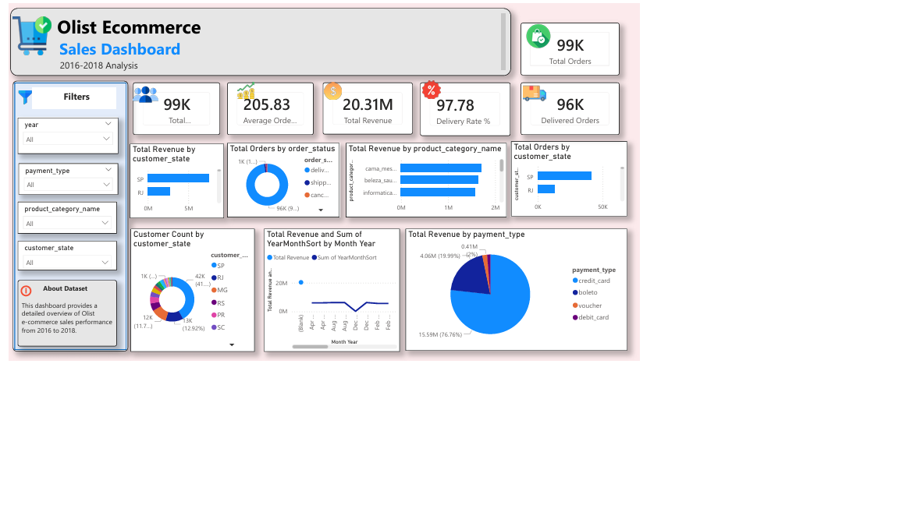

# E-Commerce Analytics Pipeline with AWS S3

## Project Overview

Built an end-to-end E-Commerce Analytics Pipeline using the Brazilian Olist E-Commerce Dataset.

This project demonstrates a complete data analytics workflow including:

* Data Profiling
* Data Cleaning and Transformation
* Fact and Dimension Table Creation
* Star Schema Data Modeling
* AWS S3 Data Storage
* Interactive Power BI Dashboard

---

## Architecture

Olist Dataset

↓

AWS S3 (Raw Layer)

↓

Python ETL Pipeline

↓

AWS S3 (Cleaned Layer)

↓

Fact & Dimension Modeling

↓

AWS S3 (Output Layer)

↓

Power BI Dashboard

---

## Technologies Used

* Python
* Pandas
* AWS S3
* Power BI
* CSV
* Data Modeling
* Star Schema
* GitHub

---

## Dataset

Brazilian E-Commerce Public Dataset by Olist

Dataset includes:

* Customers
* Orders
* Order Items
* Products
* Payments

---

## Project Structure

```text
Ecommerce-Analytics-Pipeline/
│
├── raw/
│
├── cleaned/
│
├── output/
│   ├── fact_sales.csv
│   ├── dim_customer.csv
│   ├── dim_product.csv
│   └── dim_date.csv
│
├── scripts/
│   ├── data_profiling.py
│   ├── data_cleaning.py
│   ├── create_dimensions.py
│   ├── create_fact_sales.py
│   └── validate_model.py
│
├── screenshots/
│   └── dashboard.png
│
└── README.md
```

---

## AWS S3 Data Lake Structure

```text
ecommerce-olist-dataset/
│
├── raw/
│   ├── olist_customers_dataset.csv
│   ├── olist_orders_dataset.csv
│   ├── olist_order_items_dataset.csv
│   ├── olist_order_payments_dataset.csv
│   └── olist_products_dataset.csv
│
├── cleaned/
│   ├── customers_clean.csv
│   ├── orders_clean.csv
│   └── products_clean.csv
│
├── output/
│   ├── fact_sales.csv
│   ├── dim_customer.csv
│   ├── dim_product.csv
│   └── dim_date.csv
│
└── scripts/
```

---

## Data Model

### Fact Table

* FactSales

### Dimension Tables

* DimCustomer
* DimProduct
* DimDate

The model follows a Star Schema design for efficient analytical reporting.

---

## Dashboard Insights

The Power BI dashboard provides:

* Revenue Trend Analysis
* Customer Distribution by State
* Top Product Categories
* Payment Type Analysis
* Order Status Analysis
* Interactive Filtering and Slicers

---

## Dashboard Screenshot



---

## Key Learnings

* Building ETL pipelines using Python
* Data Cleaning with Pandas
* Star Schema Design
* AWS S3 Storage Management
* Data Modeling for Analytics
* Power BI Dashboard Development
* GitHub Project Management

---

## Author

Samruddhi Padture

Aspiring Data Analyst | Python Developer | Power BI Enthusiast
